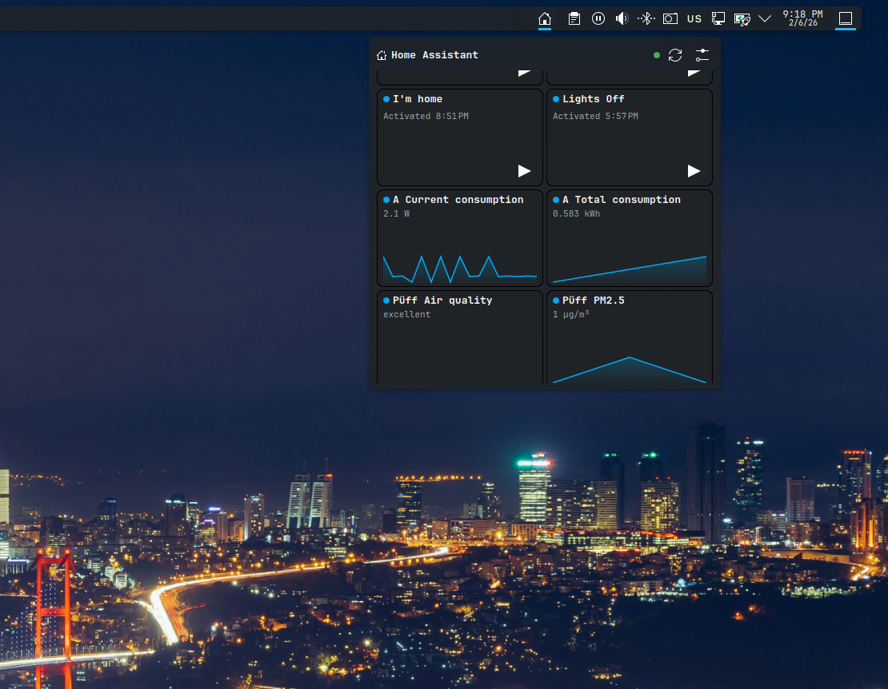

# Home Assistant KDE Plasma Applet Widget

An **unofficial** KDE Plasma 6 widget to view and control Home Assistant entities from system tray.



## Features

- Compact and expanded widget representations
- Direct Home Assistant REST API mode (recommended)
- Optional `hass-cli` mode
- Configurable entity list and refresh interval

## Requirements

- KDE Plasma 6
- Home Assistant long-lived access token
- Optional: `hass-cli` in `PATH` for CLI mode

## Install (Local)

You can either install it from releases or build from source. For local development, use:

```bash
kpackagetool6 --type Plasma/Applet --install .
```

Upgrade an existing local install:

```bash
kpackagetool6 --type Plasma/Applet --upgrade .
```

## Configuration

Set these in widget settings:

- `Home Assistant URL` (for example `http://homeassistant.local:8123`)
- `Access Token`
- `Entities`
- `Refresh interval`

Optional:

- Enable `Use hass-cli` and provide a command that outputs JSON states

## Project Layout

- `metadata.json`: Widget metadata
- `contents/ui/main.qml`: Main UI and integration logic
- `contents/config/main.xml`: Settings schema
- `contents/config/config.qml`: Settings page registration
- `contents/ui/configGeneral.qml`: Settings UI
